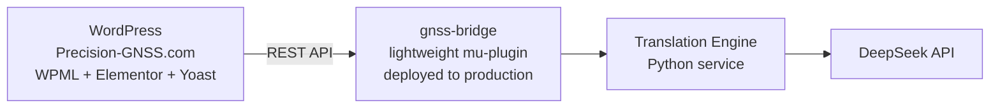
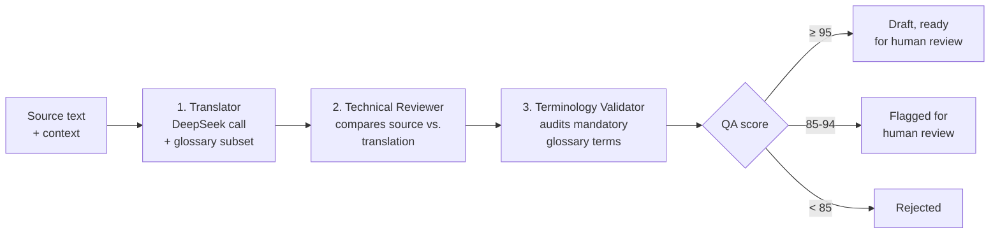

# WP AI Translation Engine

**Automated, technically-accurate English → Spanish translation for [Precision-GNSS.com](https://www.precision-gnss.com), a GNSS/RTK technical knowledge platform.**

A dedicated translation service that sits between WordPress and an AI model — never a script that pipes text through an LLM and republishes whatever comes back. Every translation is written, independently reviewed, and terminology-checked before a human ever sees it, and nothing is ever auto-published.

---

## Philosophy

Generic machine translation optimizes for text that *reads well*. This project optimizes for something else first: that the Spanish version says **exactly** the same thing as the English original — the same numbers, the same units, the same conditions, the same degree of certainty.

That distinction matters because the content is technical: RTK accuracy figures, correction-service ranges, product specifications, safety notes. A fluent-sounding mistranslation that quietly turns "1 cm accuracy" into "2 cm accuracy," or "within 5 seconds" into "in under 5 seconds," is a worse outcome than an awkward but correct sentence. So the system is built around **independent verification**, not a single AI call trusted to get everything right at once.

This isn't theoretical. During development, the Translator alone mistranslated *"achieves a fix within 5 seconds"* (i.e. in **at most** 5 seconds) as *"en menos de 5 segundos"* (in **strictly less than** 5 seconds) — a real, subtle technical drift. The independent Reviewer step caught it and correctly rejected the translation. A single combined request would very likely have missed it.

---

## ⚠️ AI Reliability & Attack Surface — read this before trusting any of it

Two questions worth answering honestly rather than with a marketing claim of "100% safe":

**Can the Translator hallucinate?** Yes — this is a real, non-zero risk with any LLM, not something this project pretends away. Real examples caught during development (see above, plus a deliberate *"1 cm accuracy"* → *"2 cm"* test case, and a statement turned into a question, altering tone). There's no formally measured "hallucination rate" — that would be false precision — but empirically, 5–10% of blocks get flagged for human review in typical runs (a mix of real issues and QA-checker false positives). What actually limits the damage: the Translator and Reviewer are two **independent** AI calls (the Reviewer has caught every example above), backed by three deterministic checks (numbers/units, protected terminology, URL preservation) — and, by **default, nothing is ever auto-published**. The worst case is a wrong draft waiting for a human, never wrong content live. (There is one explicit, opt-in exception — see "Autonomous publishing" below.)

**Could it cause a SQL injection or similarly serious exploit?** Practically no, by architecture rather than by hope: the Python engine has no database connection at all — every WordPress interaction goes through the authenticated REST API, the same path a human editor's browser uses. The one raw SQL query in the whole system (`gnss-bridge.php`, reading WPML's translation status) uses `$wpdb->prepare()` with parameterized placeholders, not string concatenation. Translated content is never interpolated into a query anywhere.

**Could the AI output malicious HTML (XSS) instead?** This *was* a real, if narrow, gap — a hallucinated `<script>`/`onclick=`/`javascript:` payload could have survived into a WordPress draft undetected. Closed 11 Aug 2026 with an allowlist-based sanitizer (`app/qa/html_sanitizer.py`) applied to every single translation before it's used anywhere — see the table below.

**Is the local dashboard itself safe to run?** Yes, with two protections: it only listens on `127.0.0.1` (never reachable from outside your machine, no network to intercept), and every action that changes state requires a per-process secret token, closing the "localhost CSRF" attack class that has hit tools like Ollama and Docker Desktop (a malicious webpage in another tab silently POSTing to a local server while it's open).

### Autonomous publishing (opt-in, off by default)

`AUTO_PUBLISH_MODE` in `.env` is the **one** deliberate way to weaken the "nothing auto-publishes" guarantee above, and it's off unless an operator explicitly sets it:

| Value | Behavior |
|---|---|
| `off` (default, or unset) | Every translation is always a draft, pending human review. Nothing in this project can publish without this variable being changed first. |
| `qa_gated` | A translation is published immediately **only** if the QA layer itself scored it `auto_approve` — anything flagged `human_review` or `reject` still becomes a draft, exactly as today. Skips the human review *step*, not the QA *gate*. |
| `all` | Every translation is published immediately, regardless of QA decision — including pages the system itself flagged as suspect. The operator's own choice to accept that risk. |

This is a persistent `.env` setting, not a one-off CLI flag, by request — which means it stays on across every run until changed back. Two things make that safer to live with: the dashboard shows a permanent red banner whenever it's active (never silent), and every log line for a live-published page is written at `WARNING`, not `INFO`, so it stands out in `logs/translate_audit.log`. `qa_gated` is the recommended setting if you use this at all — `all` bypasses the one layer (QA scoring) that has caught every real translation error found during this project's development so far.

---

## How It Works



The `gnss-bridge` component exists because WPML does not expose a public REST API for creating or linking translations — that's only possible through internal PHP hooks that must run inside WordPress itself. A minimal, auditable bridge plugin is the safest way to reach those hooks, instead of writing directly to WPML's database tables, which WPML's own documentation advises against.

### The translation pipeline



Translation and quality-checking are three **independent** AI calls, never one combined request:

1. **Translator** — writes the Spanish translation under a strict system prompt (15 mandatory rules + 6 explicit prohibitions): preserve exact meaning, numbers, units, conditions, warnings, certainty; never simplify, invent, soften, or drop technical information; never translate protected product names or acronyms without instruction.
2. **Technical Reviewer** — independently compares source and translation, hunting specifically for information added, removed, or subtly altered.
3. **Terminology Validator** — audits the translation against the domain glossary, flagging any deviation from required vocabulary (e.g. *"base station" → "estación base"*).

Each call returns strict, validated JSON (Pydantic schemas) — never free text — so results are auditable and machine-checkable, not just "trust the model."

---

## Design

Three concerns are kept deliberately apart: **WordPress never talks to DeepSeek directly, and DeepSeek has no awareness of WordPress.** An independent Python service owns all the intelligence — extraction rules, glossary logic, change detection, quality gates — and is the only thing that talks to either side.

| Decision | Why |
|---|---|
| Translation logic lives in an external Python service, not a WordPress plugin | Three sequential AI calls per block can take several seconds. Doing that inside a PHP request risks timeouts on shared hosting and has no real retry/queue story. |
| A minimal `gnss-bridge` mu-plugin bridges WPML | WPML's translation-linking hooks are PHP-only, reachable only from inside WordPress — but writing straight into WPML's database tables is explicitly unsafe per WPML's own docs. |
| Extraction works off rendered HTML, not raw Elementor JSON | `_elementor_data` isn't exposed via the REST API on this site. Elementor's own rendered output is plain HTML — headings, paragraphs, lists, buttons — and is available today. |
| Change detection is a pure, read-only function | `detect_changed_blocks()` never mutates state as a side effect of checking it — a caller decides when to persist a new baseline, after the content has actually been translated. |
| QA scoring combines 4 measurable signals, not 5 abstract dimensions | Rather than inventing scores for categories with no real data to calibrate against, the score combines what can actually be checked mechanically: numbers, protected terms, URLs, and the Reviewer's verdict. |
| Nothing is ever auto-published | Every translation lands as a draft. A human always has the final say before it goes live. |

---

## Security & Quality Controls

| Control | What it prevents |
|---|---|
| Draft-only writes by default (`AUTO_PUBLISH_MODE=off`), one explicit opt-in variable to change it | A misconfiguration accidentally publishing a page live — see "Autonomous publishing" above |
| Human review before publish (`--review` → `app/cli/publish.py`) | Anything reaching the site without a person looking at source vs. translation first |
| Per-block QA scoring (numbers/units, protected terms, URLs, Reviewer verdict) | Silent numeric drift, dropped warnings, broken links |
| Protected terminology & content detection | The AI translating product names, model numbers, or glossary-mandated terms |
| Faithful Elementor round-trip — only known text fields touched | Layout, image, or structural corruption in `_elementor_data` |
| `wpml_object_id` (modern filter), not legacy `icl_object_id` | A confirmed false-positive where the legacy filter reported a translation existed when it didn't |
| WordPress Application Password (not account login password), secrets via `.env` | Credential exposure / committing secrets to source control |
| Allowlist HTML sanitizer (`app/qa/html_sanitizer.py`) on every translation | A hallucinated `<script>`/`onclick=`/`javascript:` payload reaching a WordPress draft |
| Per-process CSRF token on the dashboard's mutating endpoints (`app/webui`) | A malicious webpage in another tab silently triggering a translation/publish while the dashboard is open |
| 261 automated tests, no live API calls in CI | Regressions shipping unnoticed |

---

## Cost

Figures below are **measured, not estimated** — computed by scraping real Precision-GNSS.com pages and running them through the project's actual `chunk_text()` splitter and real system-prompt sizes, using DeepSeek's published pricing (`deepseek-v4-pro`: $0.435 / $0.87 per 1M input/output tokens).

| Metric | Value |
|---|---|
| Average cost per page — translation only | **$0.0064** |
| Average cost per page — with full independent review | **$0.0129** |
| Cost per 1,000 characters — full pipeline | **$0.00085** (remarkably flat across every page tested) |

**In practical terms:** translating and fully reviewing a typical content page costs about one-hundredth of a dollar. A full first pass across 50 comparable pages costs roughly **$0.64** total. Ongoing cost after launch is far lower still, since the translation memory only re-translates blocks that actually changed — never a whole page for a one-paragraph edit.

Using the cheaper `deepseek-v4-flash` model for the two QA calls (keeping `deepseek-v4-pro` for translation itself) cuts the full-pipeline cost by roughly a third, with no change to translation quality since only the review layer changes model.

Full methodology and page-by-page figures: [`docs/reports/executive-summary-2026-07-23.html`](docs/reports/executive-summary-2026-07-23.html) · reproducible via [`scripts/estimate_page_cost.py`](scripts/estimate_page_cost.py).

### Full-site comparison

Scope: precision-gnss.com's current English content — 24 pages + 17 posts (~75,000 words, extrapolated from the pages already measured), costed here for English → Spanish.

| Metric | Human Translation | Professional AI (DeepL + QA) | This AI Pipeline |
|---|---|---|---|
| Spanish translation cost (full site) | €6k–11k | €1.5k–3k | **€0.50–10** |
| Human QA | High (translator + editor) | Medium (post-edit pass) | Optional/controlled — automated Reviewer + QA gate, human check only before publish |
| Automation | Low | High | **Very high** — one command, extract to WordPress draft |
| WordPress integration | Manual/extra | Usually extra (import/export plugin) | **Built-in** — REST API + WPML linking + faithful Elementor round-trip |
| Future updates | Expensive (full re-quote) | Moderate | **Very cheap** — re-translates only content that actually changed |
| Terminology control | Good (style guide, human-applied) | Very good (translation memory + glossary) | **Custom-controlled** — curated GNSS/RTK/surveying glossary, enforced per block |
| Savings vs. human | — | 70–85% | **99%+** |

Agency/SaaS figures are indicative market ranges for technical translation, shown for scale — not a vendor quote. Full breakdown: [`docs/reports/pipeline-security-cost-2026-08-11.html`](docs/reports/pipeline-security-cost-2026-08-11.html).

---

## Features

| Component | What it does |
|---|---|
| **Translator** (`app/translation/deepseek_client.py`) | Sends source text + relevant glossary subset to DeepSeek in JSON mode, returns a validated `TranslationResult` (translation, confidence, issues, terminology used) |
| **Technical Reviewer** | Independent second call comparing source vs. translation for semantic drift |
| **Terminology Validator** | Independent third call auditing mandatory glossary compliance |
| **Glossary Engine** (`app/translation/glossary.py`) | Loads domain terminology from JSON, sends only the subset relevant to each text (keeps prompts small), plus a free local check for obviously missing mandatory terms |
| **Chunking** (`app/translation/chunking.py`) | Splits long content at paragraph/sentence boundaries — never mid-number or mid-term — and reassembles translated chunks |
| **Content Extraction** (`app/extraction/`) | Walks rendered WordPress/Elementor HTML into semantic blocks (headings, paragraphs, lists, CTAs, alt text, SEO fields), explicitly protecting URLs, emails, and shortcodes from translation |
| **WooCommerce Product Extraction** (`app/extraction/woocommerce_extractor.py`) | Generic — works against any WordPress + WooCommerce site, not just this one. Extracts product name, long/short description, purchase note, attributes/options, gallery image alt text, categories/tags, and SEO. Never extracts SKU, price, stock, weight, or dimensions. Not yet validated against a live WooCommerce site (none in scope) — built and tested against the official `wc/v3/products` schema. |
| **WordPress Connector** (`app/wordpress/`) | Reads posts/pages/meta over the REST API, with dual auth (staging Basic Auth gate + WordPress Application Password) and automatic retry on 429/503 |
| **Translation Memory** (`app/storage/`, `app/synchronization/`) | SQLite-backed content-hash fingerprinting; detects new/changed/unchanged per block so only edited content is ever re-translated |
| **QA Engine** (`app/qa/`) | Numeric consistency, protected-term survival, and URL-preservation checks, combined with the Reviewer's verdict into a 0–100 score and an `auto_approve` / `human_review` / `reject` decision |

---

## Project Status

*Updated 11 August 2026 — see [`docs/reports/pipeline-security-cost-2026-08-11.html`](docs/reports/pipeline-security-cost-2026-08-11.html) for the full pipeline diagram, security/quality controls, and cost comparison.*

| Phase | Scope | Status |
|---|---|---|
| 0 | WordPress/WPML environment audit | 🟢 Complete — production access confirmed |
| 1 | `gnss-bridge` connector plugin | 🟢 Deployed to production, verified working |
| 2 | WordPress connector | 🟢 Complete |
| 3 | Content extraction (posts, pages, WooCommerce products) | 🟢 Complete — faithful Elementor round-trip (layout, images, inline formatting) |
| 4 | Translator, Reviewer, Terminology Validator, chunking | 🟢 Complete — validated against the real DeepSeek API |
| 5 | Glossary Engine | 🟢 Complete (16 curated GNSS/RTK/surveying terms) |
| 6 | Translation memory & change detection | 🟡 Designed, not built — next up |
| 7 | QA scoring engine | 🟢 Complete |
| 8 | WPML orchestration, end to end | 🟢 **Complete, verified against real production** (`precision-gnss.com`) — `app/cli/translate.py` runs Extract → Glossary → DeepSeek → QA → draft creation → `link-translation` end to end. |
| 9 | Pilot on 5 real pages | 🟡 In progress — 1 of 5 published as draft, pending native-Spanish human review |
| 10 | Scale-out & scheduled sync | ⚪ Not started |
| — | Review-then-publish flow *(added, outside the original 10 phases)* | 🟢 Complete — local side-by-side review report (`logs/progress.html`) + `app/cli/publish.py` writes the approved draft with no extra DeepSeek cost |

**261 automated tests, all passing.** Full phase-by-phase detail: [`ROADMAP.md`](ROADMAP.md), [`PLA-ACCIO.md`](PLA-ACCIO.md), running session history in [`LOG.md`](LOG.md) / [`MEMORIA.md`](MEMORIA.md).

---

## Getting Started

```bash
python -m venv .venv
.venv/Scripts/activate   # Windows; use `source .venv/bin/activate` on macOS/Linux
pip install -r requirements.txt
cp .env.example .env     # fill in your own credentials — never commit .env
```

Run the test suite:

```bash
pytest -v
```

Try a real translation (requires a `DEEPSEEK_API_KEY` in `.env`):

```bash
python scripts/translate_sample.py
```

## Project Structure

```
app/
├── translation/     # DeepSeek client, prompts, glossary, chunking
├── extraction/       # HTML → semantic content blocks
├── wordpress/         # REST API client and content reading
├── storage/            # SQLite translation memory
├── synchronization/     # Change detection
└── qa/                    # Automated quality checks and scoring

tests/            # Mirrors app/, 244 tests, no live API/network calls
scripts/          # Manual smoke tests against the real DeepSeek API / staging site
docs/             # Implementation plans, executive summary reports
```

## Documentation

- [`BIBLIOGRAFIA.md`](BIBLIOGRAFIA.md) — research and sources behind every architectural decision
- [`ROADMAP.md`](ROADMAP.md) — phase-by-phase development plan
- [`PLA-ACCIO.md`](PLA-ACCIO.md) — task-level action plan with verification criteria
- [`MEMORIA.md`](MEMORIA.md) — project decisions and context
- [`AUDITORIA-INICIAL.md`](AUDITORIA-INICIAL.md) — findings from the real staging environment audit
- [`LOG.md`](LOG.md) — chronological session log

---

*Private project for Precision-GNSS.com.*
